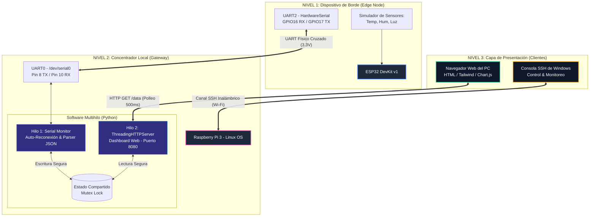

# 📄 INFORME DE LABORATORIO: SISTEMA IoT UART MULTISENSOR BIDIRECCIONAL
## Universidad Nacional de Colombia
### Facultad de Ingeniería - Departamento de Ingeniería Eléctrica y Electrónica
**Curso:** Laboratorio de Sistemas Operativos / Arquitecturas Embebidas  
**Estudiante:** Alex  
**Dispositivos:** ESP32 DevKit v1 & Raspberry Pi 3 Model B  

---

## 📌 Resumen Ejecutivo
Este documento detalla el diseño, la arquitectura física, la conexión eléctrica, el protocolo de datos y la implementación de software para establecer un canal de comunicación industrial bidireccional y robusto entre un módulo **ESP32** (nodo sensor local) y una computadora de placa única **Raspberry Pi 3** (nodo servidor/concentrador). 

El sistema simula la lectura en tiempo real de tres sensores físicos (**Temperatura, Humedad y Luz**), empaqueta la información en tramas estandarizadas **JSON**, las transmite por cable físico vía **UART** y expone los datos de manera inmediata a la red local mediante un **Dashboard Web interactivo** autohospedado en la Raspberry Pi.

---

## 🌐 1. Arquitectura General del Sistema

El sistema implementa una arquitectura híbrida de tres niveles (Edge - Gateway - Client) que combina comunicaciones físicas punto a punto con protocolos de red inalámbricos.

### 📊 Diagrama de Bloques (Arquitectura Lógica)



### Explicación del Flujo de Datos:
1.  **ESP32**: Genera valores simulados basados en ecuaciones matemáticas continuas (ondas senoidales y variaciones pseudoaleatorias) para representar las lecturas de los sensores. Construye una cadena JSON ligera y la transmite cada 1.5s por su puerto físico `Serial2`.
2.  **Raspberry Pi 3 (Hilo UART)**: Escucha permanentemente el puerto `/dev/serial0`. Al recibir la línea, la valida, decodifica el JSON y actualiza una memoria en caché protegida por un semáforo (`threading.Lock()`). Además, devuelve inmediatamente un Eco (`Eco RPi OK\n`) para retroalimentar al ESP32.
3.  **Raspberry Pi 3 (Hilo HTTP)**: Mantiene un servidor web ligero escuchando en el puerto `8080`.
4.  **PC (Cliente)**: Realiza SSH inalámbrico para controlar y monitorizar la Raspberry, y mediante el navegador web consume la página HTTP, la cual realiza peticiones asíncronas (`fetch`) cada 500ms hacia `/data` para redibujar los gráficos y gauges de manera fluida.

---

## 🔌 2. Conexiones Físicas y Niveles Eléctricos

Dado que el procesador **ESP32** y el procesador **BCM2837** de la Raspberry Pi 3 funcionan internamente a niveles lógicos de **3.3V**, es completamente seguro interconectar sus pines GPIO de manera directa sin convertidores de nivel.

> [!CAUTION]
> **¡Peligro de daño de hardware!**
> *   **NUNCA** se deben conectar los pines de alimentación de 5V o 3.3V entre el ESP32 y la Raspberry Pi. Cada tarjeta debe recibir su alimentación independiente.
> *   La conexión de la línea de **Tierra Común (GND)** es estrictamente obligatoria. Sin ella, no hay punto de referencia eléctrico para definir los niveles lógicos "0" (0V) y "1" (3.3V), lo que provocaría lecturas corruptas por ruido eléctrico.

### Tabla de Conexión de Pines (Pinout)

| Señal | Pin Físico en ESP32 | Pin Físico en Raspberry Pi 3 | Dirección del Flujo | Propósito |
| :--- | :--- | :--- | :---: | :--- |
| **GND** | **GND** | **Pin 6 (GND)** | $\longleftrightarrow$ | Referencia de Tierra Común |
| **TX** | **TX2 / GPIO 17** | **Pin 10 (RXD / GPIO 15)** | $\longrightarrow$ | Transmisión de ESP32 a Recepción de RPi |
| **RX** | **RX2 / GPIO 16** | **Pin 8 (TXD / GPIO 14)** | $\longleftarrow$ | Recepción de ESP32 desde Transmisión de RPi |

---

## 📨 3. Protocolo de Comunicación y Estructura de Datos

### Parámetros de Configuración del Puerto Serial:
*   **Baudrate:** 115,200 baudios (velocidad de transmisión de bits).
*   **Data Bits:** 8 bits de datos estándar.
*   **Parity:** None (sin bit de paridad para máxima ligereza).
*   **Stop Bits:** 1 bit de parada.
*   **Control de Flujo:** Ninguno (sin RTS/CTS ni XON/XOFF).

### Estructura de la Trama JSON (ESP32 $\rightarrow$ RPi):
Para facilitar la escalabilidad y permitir el envío de múltiples sensores sin depender del orden posicional, se implementó el estándar **JSON** codificado en caracteres **UTF-8**. La trama finaliza estrictamente con un salto de línea (`\n`) para delimitar el fin de paquete:

```json
{"t": 25.42, "h": 60.3, "l": 2048}
```
*   `t` *(float)*: Temperatura simulada en grados Celsius (°C).
*   `h` *(float)*: Humedad relativa en porcentaje (%).
*   `l` *(int)*: Nivel de luminosidad crudo leído por el ADC (Rango 0 - 4095).

### Trama de Eco de Retorno (RPi $\rightarrow$ ESP32):
Al procesar con éxito la trama JSON, la Raspberry Pi responde de inmediato por el cable TX con un salto de línea terminal para confirmar la recepción:
```text
Eco RPi OK\n
```

---

## 🛠️ 4. Configuración Crítica del Sistema Operativo de la Raspberry Pi

El puerto serial por hardware de los pines físicos 8 y 10 en la Raspberry Pi 3 está controlado internamente por el sistema operativo. Para poder usarlo libremente con el script de Python, se deben aplicar las siguientes configuraciones mediante la terminal SSH:

### 1. Desvincular la Consola del Sistema del Puerto Serial
Por defecto, Linux inicia una terminal interactiva (Login Shell) sobre este puerto. Para desactivarlo:
1.  Ejecutar en la terminal de la RPi:
    ```bash
    sudo raspi-config
    ```
2.  Navegar a: **Interface Options** $\rightarrow$ **Serial Port**.
3.  *¿Would you like a login shell to be accessible over serial?* $\rightarrow$ Seleccionar **NO**.
4.  *¿Would you like the serial port hardware to be enabled?* $\rightarrow$ Seleccionar **YES**.
5.  Finalizar y reiniciar la placa para aplicar los cambios del Kernel.

### 2. Gestión de Permisos de Dispositivos UART (Grupo `dialout`)
Por seguridad, los archivos de dispositivos físicos en `/dev/` pertenecen al administrador. El usuario común `alex` no tiene permisos por defecto para abrir `/dev/serial0`. 
Para otorgar acceso permanente sin requerir el uso de `sudo`, se debe añadir el usuario al grupo de comunicaciones del sistema:
```bash
sudo usermod -a -G dialout alex
```
*(Nota: Requiere cerrar sesión `exit` y volver a conectarse por SSH para que Linux refresque los grupos del usuario).*

### 3. Solución de Ruteo para Entornos de Laboratorio Directos
Al conectar la Raspberry Pi directamente al PC por cable Ethernet y simultáneamente a la red Wi-Fi de internet, Linux puede confundir las rutas de red intentando descargar actualizaciones del sistema por el cable Ethernet inactivo.
Para forzar a que la Raspberry acceda a Internet a través de su Wi-Fi (`wlan0`) para actualizar paquetes y descargar dependencias, se debe ejecutar:
```bash
sudo ip route del default dev eth0
```
Esto elimina temporalmente la puerta de enlace muerta del puerto Ethernet, enrutando todo el tráfico de internet de forma exitosa por la interfaz inalámbrica.

---

## 💻 5. Explicación del Diseño de Software

### A. Firmware de la ESP32 (`esp32_uart.ino`)
*   **Simulación Continua**: Utiliza la función `sin()` y `cos()` combinadas con la marca de tiempo `millis()` y variaciones `random()` para generar trayectorias analógicas continuas e hiperrealistas del sensor LM35, DHT22 y una fotorresistencia LDR.
*   **Construcción Dinámica Ligera**: En lugar de utilizar librerías JSON complejas de C++ que consumen RAM dinámica, formatea la trama manualmente mediante concatenación limpia de objetos `String`.
*   **Lectura no Bloqueante**: Escucha continuamente el buffer serial2 de entrada sin interrumpir el intervalo de transmisión.

### B. Servicio de la Raspberry Pi (`raspberry_uart.py`)
*   **Multihilo Seguro**: El script corre dos hilos de ejecución concurrentes:
    1.  **Hilo de Borde (UART)**: Ejecuta un bucle infinito que intenta abrir el puerto `/dev/serial0`. Si detecta un fallo físico (`OSError` o `SerialException` por cables flojos o reboots), cierra el puerto ordenadamente, evita que el script principal crashe y reintenta la reconexión cada 2 segundos.
    2.  **Hilo Servidor (HTTP)**: Un servidor web asíncrono ultra-ligero que atiende peticiones en el puerto `8080`. Sirve un espectacular panel web en HTML5/Tailwind/Chart.js y expone un endpoint `/data` que entrega el estado en JSON.
*   **Mapeo Seguro**: Ambos hilos comparten el diccionario `system_state`. La sincronía de lectura y escritura se coordina mediante un candado de exclusión mutua (`state_lock = threading.Lock()`) para prevenir corrupción de memoria o colisiones de datos.

---

## 📈 6. Resultados Esperados y Verificación

### Captura de Consola SSH (Raspberry Pi):
Al correr el programa, la terminal SSH mostrará logs minimalistas y sumamente claros de las tramas procesadas exitosamente:
```text
alex@rasp:~ $ /home/alex/raspberry_uart.py
[-] UART Monitor con Dashboard iniciado (/dev/serial0 @ 115200). Ctrl+C para salir.
[HTTP] Dashboard disponible en: http://localhost:8080
[OK] UART Conectado con la ESP32.
[RX] JSON: T=25.32°C | H=60.8% | L=2048
[RX] JSON: T=25.45°C | H=60.4% | L=2062
[RX] JSON: T=25.56°C | H=60.1% | L=2110
[ERROR] UART Desconectado: [Errno 5] Input/output error
[+] Reintentando conexion UART en 2s...
[+] Reintentando conexion UART en 2s...
[OK] UART Conectado con la ESP32.
[RX] JSON: T=24.80°C | H=61.2% | L=1980
```

### Visualización del Dashboard Web (`http://192.168.1.17:8080`):
En el navegador del PC del usuario se expondrá un panel interactivo con las siguientes secciones:
1.  **Badge de Enlace**: Cambia de color a verde brillante de forma instantánea al detectar el apretón de manos serial, y a rojo parpadeante ante pérdidas físicas de señal.
2.  **Tarjetas Glassmorphism**:
    *   *Temperatura*: Muestra la escala exacta en tiempo real (Celsius).
    *   *Humedad*: Muestra el porcentaje relativo.
    *   *Luz*: Muestra la conversión directa del valor ADC de 12 bits a escala porcentual de brillantez ($0 - 100\%$).
3.  **Gráfico de Tendencia Histórica**: Muestra una curva continua de tres colores (Morado para Temperatura, Azul para Humedad y Amarillo para Luz) que se desplaza de forma interactiva en la pantalla cada vez que la ESP32 realiza una transmisión.

---

## 📝 7. Conclusiones
*   La comunicación mediante el protocolo UART representa una solución de bajo nivel y sumamente robusta para la integración local de sistemas embebidos de borde con servidores locales.
*   El uso del formato estructurado **JSON** para transmitir telemetría multi-sensor demostró ser altamente flexible, eliminando los riesgos de desalineación posicional comunes en los protocolos de delimitación simple (como CSV).
*   La arquitectura multihilo implementada en Python garantiza un sistema de alta disponibilidad: la caída física de un nodo o el desprendimiento temporal de un cable no afecta el servicio web ni la disponibilidad del dashboard para los clientes de la red.
*   La unificación eléctrica de las tierras (GND) es vital para la integridad de los datos a altas velocidades de baudios (115200 bps), amortiguando el ruido electromagnético ambiental.
